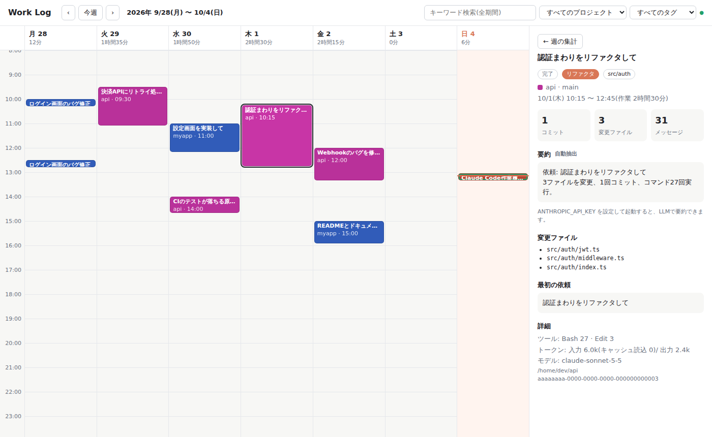

# Work Log

Claude Code の作業履歴を `~/.claude/projects/` 配下の JSONL から自動で収集し、週カレンダーで可視化するローカル Web アプリです。OpenAI Codex CLI のログ(`~/.codex/sessions/`)にも対応しています。「いつ、どのプロジェクトで何をしていたか」を一目で確認できます。



## 特徴

- 依存パッケージなし(Node.js 20 以上)
- `127.0.0.1` のみで待ち受け
- ログは外部に送信しません。LLM 要約だけはオプトインで、送信前に秘匿情報をマスキングします
- Claude Code と Codex CLI の両方のログを、同じカレンダーとコストの画面で扱います(ツールで絞り込めます)
- ログの変更をファイル監視で検知し、画面を自動更新します
- Claude Code の hooks に登録すると、作業中・入力待ちの状態をリアルタイムに表示します(任意)

## 使い方

```sh
npm start                          # サーバーを起動 (既定: http://127.0.0.1:4317)
node src/cli.js [--port N]         # ポートを指定して起動
node src/cli.js scan               # ログを解析してセッション一覧をターミナルに表示
node src/cli.js summarize [ID]     # LLM で要約 (ID を省略すると、完了済みで未要約のセッションすべて)
node src/cli.js summarize ID --force   # 要約済みでも再生成
node src/cli.js hooks install      # Claude Code の hooks に登録 (hooks 連携を参照)
node src/cli.js hooks status       # 登録状況を表示
node src/cli.js hooks uninstall    # 登録を削除
npm test                           # テストを実行
```

ポートは `--port`、環境変数 `PORT`、既定値 4317 の順に決まります。`summarize` は `ANTHROPIC_API_KEY` が未設定だとエラー終了します。

## 環境変数

| 変数 | 説明 |
| --- | --- |
| `ANTHROPIC_API_KEY` | 設定すると LLM 要約が有効になります。未設定なら使えません |
| `WORKLOG_MODEL` | 要約に使うモデル。既定は `claude-haiku-4-5-20251001` |
| `WORKLOG_PROJECTS_DIR` | ログの読み取り先。既定は `<CLAUDE_CONFIG_DIR>/projects` |
| `CLAUDE_CONFIG_DIR` | Claude Code の設定ディレクトリ。既定は `~/.claude` |
| `WORKLOG_CODEX_DIR` | Codex のログの読み取り先(その下の `sessions/` と `archived_sessions/`)。未設定なら `CODEX_HOME`、それも無ければ `~/.codex` |
| `CODEX_HOME` | Codex CLI のホームディレクトリ。`WORKLOG_CODEX_DIR` が未設定のときに使います |
| `WORKLOG_CACHE_DIR` | キャッシュの保存先。既定は `~/.work-log` |
| `WORKLOG_NO_MASK=1` | 画面表示時のマスキングを無効にします |
| `PORT` | 待ち受けポート(`--port` が優先) |

## Codex 対応

OpenAI Codex CLI のセッションログを、Claude Code と同じ集計レコードにして表示します。Codex が無い環境ではフォルダが存在しないだけで、何も起きません。

形式は openai/codex リポジトリの codex-rs(rollout / protocol)のソースに合わせて実装しています。実際の Codex を動かしての確認はしていません(この開発環境では OpenAI の API に接続できないため)。

### 読み取り先

- `$WORKLOG_CODEX_DIR` → `$CODEX_HOME` → `~/.codex` の順に決め、その下の `sessions/YYYY/MM/DD/rollout-*.jsonl` と `archived_sessions/` を読みます。
- Codex は 7 日以上前のログを `.jsonl.zst` に圧縮します。圧縮ログは Node.js 22.15 以降なら読めます。それ未満では警告を出して読み飛ばします。
- 同じログの圧縮版と未圧縮版が両方あるときは、未圧縮版を使います。
- 旧形式(行に `type` / `payload` の包みが無いログ)も読みます。

### 抽出する内容

- 依頼: `event_msg` の `user_message` です。無い古いログは、`response_item` のユーザーメッセージから拾います。Codex が差し込む `<environment_context>` などは除外します。
- 応答数: アシスタントのメッセージ数です。
- 変更ファイル: `apply_patch` の対象ファイルです。
- コマンド: シェル系ツールのコマンドです。`git commit` / `git push` も数えます。結果が `exec_command_end` と `function_call_output` の両方に出ても、1 回だけ数えます。
- モデル: `turn_context` から取ります。
- ブランチ: `session_meta` の git 情報から取ります。
- 利用量: `token_usage_record` があればそれを使います。無ければ `token_count` を、累計が増えたときだけ数えます。`input_tokens` からキャッシュ分を引き、`output_tokens` は推論トークンを含む値のまま使います。

### 画面での扱い

- ツールが 2 種類以上あると、ヘッダーに「すべてのツール / Claude Code / Codex」の絞り込みが出ます。カレンダー、検索、コストに効きます。
- Codex のブロックは、斜線のテクスチャとメタ行の「Codex」で見分けます。詳細パネルにはツールのバッジを表示します。
- コストのグラフでは「OpenAI」系統として表示します。単価は利用者が設定します(「コスト」の「単価表の上書き」を参照)。
- hooks 連携と、LLM 要約の hooks 部分は Claude Code のみです。Codex には hooks が無いため、状態はログの更新時刻で判定します。
- Git 連携は Codex のセッションにも効きます。

## 画面

- 週ビュー: 縦軸が時間、横軸が曜日(月曜始まり)です。日付の見出しにはその日の作業時間の合計が出ます。
- ブロック: セッションのアクティビティ区間です。30 分以上の空白があるとブロックを分けます。色はプロジェクトごとに決まります。重なるブロックは横に並べて表示します。
- 状態: hooks 連携が有効なときは「作業中」「入力待ち」「完了」を表示します(詳細は「hooks 連携」)。hooks 未設定のときは、ログの最終更新から 5 分以内のセッションを「作業中」、それ以外を「完了」とみなします。作業中のセッションは、最後のブロックを現在時刻まで伸ばして表示します。
- ヘッダーのバッジ: hooks が登録済みなら「hooks連携中」、未登録なら「hooks未設定」と表示します。
- 詳細パネル: ブロックをクリックすると表示します。状態、作業種別、コンポーネント、期間、コミット数、変更ファイル数、メッセージ数、要約、変更ファイル一覧、最初の依頼、使用ツール、トークン数、モデル、API 換算コストを確認できます。コスト行には、サブエージェント分の件数と金額の内訳も出ます(「コスト」を参照)。hooks のイベントがあるセッションでは、開始種別、終了理由、最終イベントも表示します。何も選んでいないときは、その週のプロジェクト別作業時間と、週に動いたセッションの API 換算コストの合計(週をまたぐセッションは全体の額)を表示します。
- フィルタ: プロジェクトとタグ(作業種別・コンポーネント)で絞り込めます。詳細パネルのタグをクリックしても絞り込めます。
- キーワード検索: 全期間が対象です。タイトル、要約、プロジェクト名、ブランチ名、依頼文、変更ファイル、コンポーネントを検索します。結果をクリックすると該当の週に移動します。
- 自動更新: ログディレクトリを監視し、変化があれば差分スキャンして画面を更新します。60 秒ごとにも再確認するので、「作業中」から「完了」への切り替えも反映されます。hooks 連携が有効なら、イベントの受信でも即時に更新します。

## コスト

ヘッダーの「カレンダー / コスト」で表示を切り替えます。コストビューは「週 / 月」を切り替えられ、‹ › で期間を移動します。プロジェクトとツールのフィルタが効きます(タグは効きません)。

- KPI: 合計、作業日あたり、トークン、キャッシュヒット率です。キャッシュヒット率は、入力側(入力、キャッシュ読込、キャッシュ書込)のうちキャッシュ読込の割合です。
- 日別の積み上げ棒: モデル系統(Opus / Sonnet / Haiku / Fable / OpenAI / その他)別です。色は系統に固定です。ホバーすると内訳を表示します。
- 表: モデル別とプロジェクト別です。コスト、割合、入力・出力・キャッシュ読込・キャッシュ書込のトークン数を表示します。
- コストの大きいセッション: 上位 10 件です。クリックすると詳細パネルを開きます。詳細パネルには、そのセッションの API 換算コストを表示します。サブエージェントを含む場合は、その件数と金額を併記します。

注意: 表示するのは API で使った場合の換算額です。Pro / Max などの定額プランの請求額ではありません。単価は `src/pricing.js` の表(公式価格ページ、2026-10-04 時点)で、価格が改定されたらここを更新します。

### 計算方法

- 入力、出力、キャッシュ読込(モデルごとの実額)、キャッシュ書込を計上します。キャッシュ書込は 5 分が入力単価の 1.25 倍、1 時間が 2 倍です。内訳のない古いログは 5 分として扱います。
- fast モードは、対応モデル(Opus 5.5 / 5 / 4.8)の fast 用の単価で計算します。キャッシュの倍率はその単価に掛かります。
- `inference_geo` が `us` の応答は、4.6 以降のモデルで 1.1 倍にします。
- Web 検索は 1,000 回あたり $10 です。
- モデル ID は、日付付き(`claude-opus-4-5-20251101` など)、`[1m]` 付き、Bedrock 形式(`anthropic.claude-…`)でも単価表に当てます。
- 単価表にないモデルは「単価不明」と表示し、合計から除外します。`<synthetic>` などの API を呼んでいない応答は数えません。

### 単価表の上書き

`~/.work-log/pricing.json`(`WORKLOG_CACHE_DIR` 配下)に単価を書くと、組み込みの表より優先して使います。OpenAI のモデルの単価は組み込んでいないため、Codex のコストを出すにはここに書きます(書かないと「単価不明」として表示し、合計から除外します)。Claude の単価の上書き(価格改定への追従)にも使えます。

```json
{
  "<モデルIDの前方一致>": { "input": 入力単価, "output": 出力単価, "cacheRead": キャッシュ読込単価, "cacheWrite": キャッシュ書込単価 }
}
```

- 単位は USD / 100 万トークンです。キーはモデル ID の前方一致で、長いキーが優先されます。
- `cacheRead` を省くと入力単価の 0.1 倍です。`cacheWrite` を省くと、5 分が入力単価の 1.25 倍、1 時間が 2 倍です。
- 値は公式の価格ページで確認して書いてください。
- ファイルは解析のたびに読み直します。読めない場合は警告を出し、組み込みの単価だけを使います。

### 集計

- 利用量は、1 時間・モデル単位(UTC)で解析結果に保持します。日付への振り分けは、ブラウザのタイムゾーンで行います。
- サブエージェントのログ(`<セッション>/subagents/*.jsonl`)の利用量は、親セッションと親のプロジェクトに合算します。独立したセッションとしては表示しません。

### 精度の注意

- 1 つの応答がログの複数行に分かれているときは、最後の usage を採ります。
- `stop_reason` のない応答(サブエージェントのログで確認)は、ストリーム開始時点の usage しか残らず、`output_tokens` が極端に小さくなります。そのため、本文(テキストとツール入力)の長さから約 2 文字 = 1 トークンで出力を見積もり、記録値より大きければそちらを使います。見積もりを使った分は、画面に「一部見積もり」と表示します。
- thinking の本文はログに残らないため、見積もりは実際より少なめになることがあります。

## hooks 連携

Claude Code の hooks に登録すると、セッションの開始・依頼の送信・応答の完了・終了を検知し、状態をリアルタイムに表示できます。登録しなくても、ログの解析だけで動きます。

```sh
node src/cli.js hooks install                       # 登録
node src/cli.js hooks install --dry-run             # 書き込まず、登録内容だけ表示
node src/cli.js hooks install --settings PATH       # 対象の settings.json を指定
node src/cli.js hooks status                        # 登録済みのイベントを表示
node src/cli.js hooks uninstall                     # 登録を削除
```

- 登録先: `$CLAUDE_CONFIG_DIR/settings.json`(既定は `~/.claude/settings.json`)。`--settings` で変更できます。`status` と `uninstall` にも使えます。
- 既存の設定とほかのフックはそのまま残します。書き換える前に `settings.json.work-log.bak` を作ります。settings.json が壊れた JSON のときは、何も変更せず中止します。
- 登録するイベント: `SessionStart` / `UserPromptSubmit` / `Stop` / `SessionEnd`
  - `SessionStart` と `UserPromptSubmit` は async で実行し、Claude Code を待たせません。
  - `Stop` と `SessionEnd` は同期で実行します(タイムアウト 5 秒)。`claude -p` などは直後にプロセスが終わるため、async だと記録前に打ち切られることを実機で確認しています。応答の表示後に約 0.2 秒かかります。
- 登録するコマンドは `node "<絶対パス>/src/cli.js" hook --work-log` です。末尾の `--work-log` で自分のフックを識別するので、リポジトリを移動したら `hooks install` をやり直せば置き換わります。`node` が PATH にある必要があります。

### 仕組み

1. フックは stdin の JSON から必要な項目(イベント名、セッション ID、cwd、トランスクリプトのパス、開始種別、終了理由)だけを `~/.work-log/events.jsonl` に追記します。依頼文の本文は保存しません。
2. 起動中のサーバーがあれば、`server.json` に書かれたポートへ通知します(`POST /api/hook`)。
3. サーバーは `events.jsonl` の追記分だけを取り込み、画面を即時に更新します。サーバー停止中のイベントは、次回の起動時に取り込みます。

フックは標準出力に何も書かず、失敗しても常に exit 0 で終わるので、Claude Code の動作を妨げません。`events.jsonl` は 5MB を超えると、取り込み後に作り直します。

### 状態の表示

- 作業中: `UserPromptSubmit` の後です。
- 入力待ち: `Stop` の後、または `SessionStart` の後です。
- 完了: `SessionEnd` を受けたとき、または最後のアクティビティ(ログの更新とフックのイベントの新しいほう)から 30 分経ったときです。端末を閉じたりクラッシュしたりして終了イベントが来ない場合も、完了になります。

詳細パネルには、開始種別、終了理由、最終イベントを表示します。

### 注意

Claude Code on the web などのクラウドセッションは、ユーザーの `~/.claude/settings.json` を読みません。この連携はローカルの Claude Code 向けです。

## Git 連携

詳細パネルを開いたとき、セッションの作業ディレクトリのリポジトリを読み、コミットをセッションに紐付けます。読み取り専用の `rev-parse` / `config` / `remote` / `log` だけを、シェルを介さずに実行します(タイムアウト 5 秒)。

- 種類:
  - 「Claude」: ログ上のハッシュと一致するコミット、または `-q` コミットの実行時刻から 2 分以内のコミットです。
  - 「同時間帯」: セッションの各区間の 2 分前から 10 分後までに、そのリポジトリの `user.email` と同じ作者が作ったコミットです。`--all` で全ブランチを対象にします。同僚のコミットは除外します。
- ログにあるがリポジトリに見つからないコミット(amend や rebase で書き換えた、別のマシンで作った、など)は「見つかりません」と表示します。
- 作業中のセッションは、現在時刻までを対象にします。
- 表示内容: 短縮ハッシュ、件名、時刻、作者、ファイル数、+追加/−削除、合計です。リモートが GitHub / GitLab / Bitbucket なら、ハッシュはコミットページへのリンクになります。URL 中の認証情報は落とします。作者のメールアドレスは画面に返しません。
- 結果は 60 秒キャッシュします。
- リポジトリがない、または git がない場合は、ログから抽出したコミットだけを表示します。
- 週の集計にコミット数を表示します。キーワード検索では、コミットのハッシュと件名も検索できます。

## 各値の算出方法

- コミット数: Bash ツールで実行された `git commit` のうち、成功したものの数です。ヒアドキュメントの本文や文字列の中にある "git commit" は数えません。出力の `[branch hash] 件名` でハッシュを確認できたものと、エラーにならなかったがハッシュが出なかったもの(`-q` など)を数えます。失敗したもの(`nothing to commit` など)は数えません。
- 変更ファイル: Edit / Write / MultiEdit / NotebookEdit の対象ファイルです。重複は除き、プロジェクト配下のパスは相対パスで表示します。
- メッセージ数: ユーザーの実際の依頼文とアシスタントの応答の合計です。ツール結果やシステム通知は含みません。
- 作業種別・コンポーネント(自動抽出): API キーがなくても動くルールベースの推定です。
  - 作業種別は、タイトルと最初の 5 件の依頼文をキーワードで採点して決めます。種別は「バグ修正」「リファクタ」「テスト」「ドキュメント」「機能」「調査」です。該当がなければ、ファイル変更があれば「機能」、なければ「調査」になります。
  - コンポーネントは、変更ファイルのパスから上位ディレクトリ単位で推定します(最大 4 件)。
  - 要約は、最初の依頼と変更ファイル数・コミット数・コマンド実行回数から組み立てます。
- 作業種別・コンポーネント・要約(LLM): 詳細パネルの「LLM で要約」ボタンか `summarize` コマンドで明示的に実行したときだけ、Claude API を呼び出します。結果はタイトル、要約、作業種別、コンポーネントとして上記の自動抽出の代わりに表示します。送る内容は、プロジェクト名、ブランチ、変更ファイル、コミット数、依頼文、実行コマンドの抜粋、アシスタントの最終応答で、すべてマスキング済みです。
- マスキング: API キー、トークン、JWT、秘密鍵、`password=` などの代入、URL 内の認証情報、メールアドレスを置き換えます。要約の送信前と、画面に返す API 応答の両方に適用します。

## キャッシュ

`WORKLOG_CACHE_DIR`(既定 `~/.work-log`)に次のファイルを保存します。

- `sessions.json`: 解析結果です。mtime または size が変わったログファイルだけを再解析します。形式を変えたため(コスト計算用の利用量を追加)、更新後の初回起動時は全ログを再解析します。サブエージェントのログも対象です。
- `summaries.json`: LLM 要約です。内容(最終時刻とメッセージ数)が同じセッションは再要約しません。セッションがその後に進んでも、要約は表示し続け「セッション更新あり」と示します。再生成するのは、再要約ボタンまたは `--force` を使ったときだけです。
- `events.jsonl`: hooks から届いたイベントの追記先です。5MB を超えると、取り込み後に作り直します。
- `hooks-state.json`: `events.jsonl` の取り込み位置と、セッションごとの最新状態です。
- `server.json`: 起動中のサーバーのポートと PID です。フックが通知先を知るために使い、サーバーの終了時に削除します。
- `pricing.json`: 単価表の上書きです(任意、利用者が作成)。形式は「コスト」の「単価表の上書き」を参照してください。

## ディレクトリ構成

```
src/
  cli.js         コマンドラインの入口 (serve / scan / summarize / hooks / hook)
  server.js      HTTP サーバー、API、ファイル監視、更新通知、フックからの通知の受け口
  store.js       ログの収集、JSON キャッシュ、要約の管理、セッション状態の判定
  paths.js       ログとキャッシュの場所
  hook.js        hooks から呼ばれる受け口。events.jsonl への追記とサーバーへの通知
  live.js        events.jsonl の取り込みと、作業中/入力待ち/完了の判定
  install.js     Claude Code の settings.json へのフックの登録・削除
  git.js         Git 連携。リポジトリを読み取り専用で参照し、コミットをセッションに紐付ける
  parser.js      JSONL を 1 セッションの集計レコードに変換
  codex.js       Codex CLI のログ(rollout)を同じ集計レコードに変換。.zst の読み込みも担当
  pricing.js     モデルの単価表と、利用量からの API 換算コストの計算。pricing.json による上書き
  tagger.js      ルールベースの作業種別・コンポーネント推定と要約
  summarizer.js  Claude API による要約 (オプトイン)
  mask.js        秘匿情報のマスキング
public/          ブラウザ UI (index.html, app.js, costs.js, style.css)
                 costs.js はコストビュー (KPI、日別の積み上げ棒、表)
test/            テスト
docs/            ドキュメント (requirements.md)
```
